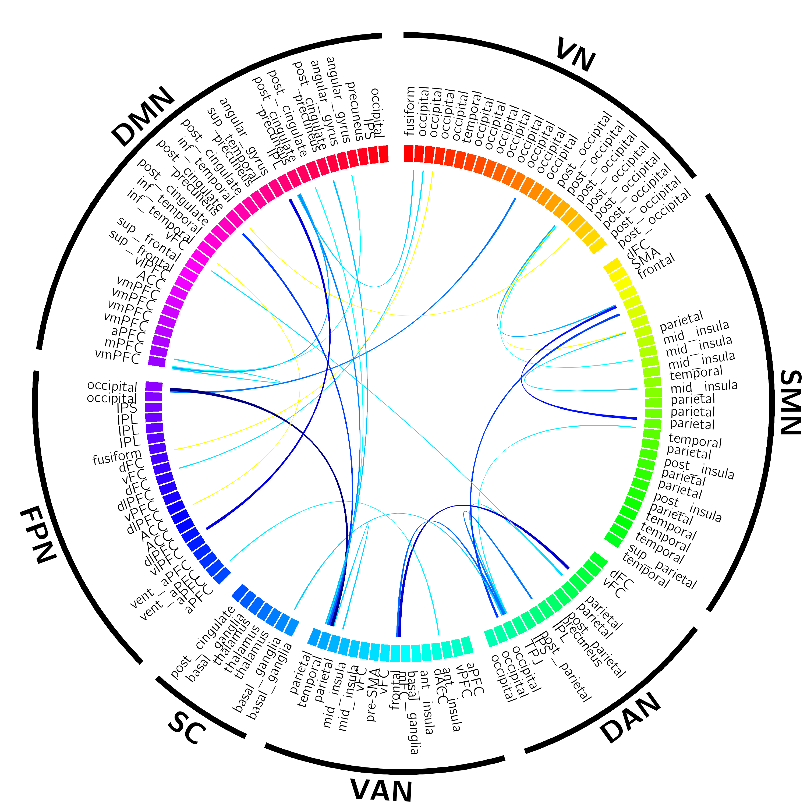

# CorticalNetworkCircos
 Circos plot describes cortical networks and regions

## Source code introduction:

**CircosPlot.conf**

Configuration file conducts Circos to plot.

**CircosDataOrganize.m**

MATLAB function for organize data to satisfy Circos source txt file format, and define details of cortical map.

**EditConf.m**

Configure Circos .conf file.

**TEST_function.m**

Script demostrates how to set parameter of function.

**CircosInput1_network.txt**

File stores data of external network.

**CircosInput2_region.txt**

File stores data of internal region.

**CircosInput3_label.txt**

File stores data of internal band label.

**CircosInput4_link.txt**

File stores data of links between correlated regions

**MANUAL_DataFormat.txt**

Manual demostrate data format of source mat file.

**CircosStruct.mat**

Demo source data, can immitate format.

**linkCmap.mat**

Store colormap for link.

---

