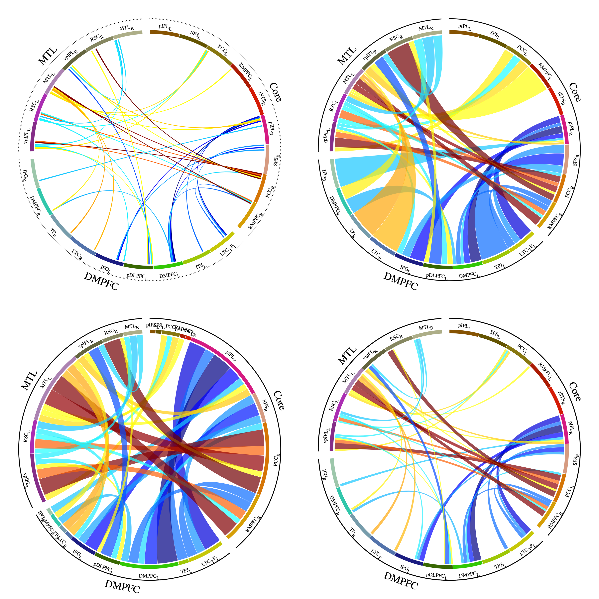

# CorticalNetworkCircos
 Circos plot describes cortical networks and regions

There are **4 modes** as shown above, you can choose by setting parameter.

Using colormap shown above.

PS: recommand using SVG image.

## Source code introduction:

0. **CircosPlot.conf**

Configuration file conducts Circos to plot.

1. **CircosDataOrganize.m**

MATLAB function for organize data to satisfy Circos source txt file format, and define details of cortical map.

2. **EditConf.m**

Configure Circos' .conf file.

3. **TEST_function.m**

Script demostrates how to set parameter of function.

4. **CircosInput1_band.txt**

File stores data of external network and internal region band.

5. **CircosInput2_label.txt**

File stores data of internal band label.

6. **CircosInpput3_link.txt**

File stores data of links between correlated regions

7. **MANUAL_DataFormat.txt**

Manual demostrate data format of source mat file.

8. **RawDataCircos.mat**

Demo source data, can immitate format.

9. **cmap.mat**

Store colormap.

---

